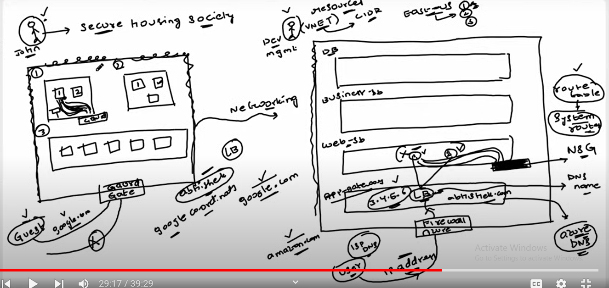
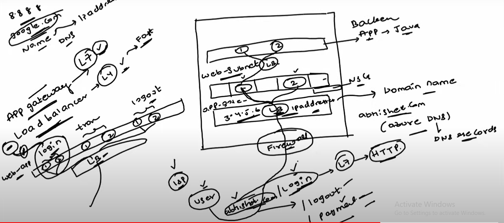

###  What is VNET?

Imagine there is no VNET concept , there are 2 customers one is apple and another is Samsung both requested to create a virtual machines in us-east AD-1 , unfortunately both the VM’s got created on the same physical server . here comes the biggest problem if one server got hacked then automatically another server will also be accessible because they both are on the same physical server .

To over come this kind of security problems VNET came into picture , if apple requested one VM in us-east-1 and AD-1 and apple already have it’s VNET then that VM will be created within it’s VNET , no other customers VM can be created in that VNET , in this way we can achieve security in Azure cloud.

*  It is possible to have multiple VNET’s for the same organization .
*  We need to provide the range of VNET while creating whether it’s x.x.x.x/16 or x.x.x.x/24 or something else , so that it will reserve that many ip addresses to that VNET.
*  We can divide the VNET into multiple subnets to use it efficiently .
*  By using subnets we can logically isolate the resources in VNET , we can apply NSG(network security groups ) at subnet level so that it will be easy to manage multiple resources at the same time .
*  ASGs group Azure virtual machines based on application requirements, simplifying network security:
*  With combination of NSG+ASG we can achieve more security .

A Virtual Network (VNet) in Azure is a logically isolated network that securely connects Azure resources and extends on-premises networks. 
Key features include:

*	Isolation: VNets provide isolation at the network level for segmenting resources and controlling traffic.
*	Subnetting: Divide a VNet into subnets for resource organization and traffic control.
*	Address Space: VNets have an address space defined using CIDR notation, determining the IP address range
  
**Routes**

Routes dictate how network traffic is directed, specifying the destination and next hop.
Route Tables
Route Tables are collections of routes associated with subnets, enabling custom routing rules

**Virtual Network Peering**

Virtual Network Peering allows connecting Azure Virtual Networks directly, enabling resources in one VNet to communicate with resources in another. Key features include:

*  Global VNet Peering: Peering can be established across regions.
*  Transitive Routing: Traffic between peered VNets flows directly, improving performance.

**VNet Gateway**

VNet Gateway enables secure communication between on-premises networks and Azure Virtual Networks. 
Key features include:

*  Site-to-Site VPN: Connects on-premises networks to Azure over an encrypted VPN tunnel.
*  Point-to-Site VPN: Enables secure remote access to Azure resources.

**VPN Gateway**

Azure VPN Gateway provides secure, site-to-site connectivity between your on-premises network and Azure.
Key features include:

*  IPsec/IKE VPN Protocols: Ensures secure communication over the Internet.
*  High Availability: Supports active-active and active-passive configurations for high availability.
*  BGP Support: Allows dynamic routing between your on-premises network and Azure.

